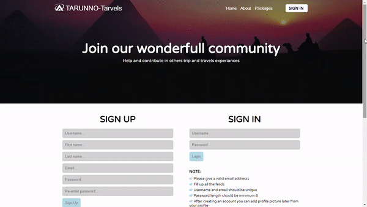

# Travel-Guide-React-Django
### Travel guide web application with ReactJs and Django REST framework.
### Class components
## Home page:

## Front-end: ReactJs
#### 1. React router
#### 2. React state and props
#### 3. Components 
#### 4. Mounting 
#### 5. Responsive and Interactive
## Singin and profile:

### This was my first website I have built in ReactJs along with Django REST frameworks. 
## Back-end: Django REST frameworks and SQLite3
#### 1. corsheaders
#### 2. token authentication 
#### 3. CURD
## Place:

### In back-end I have built a REST API using django. It has CURD fauntionalities. We can authenticate users and upload profile image also.
## API overview:

# Super user: Travel
